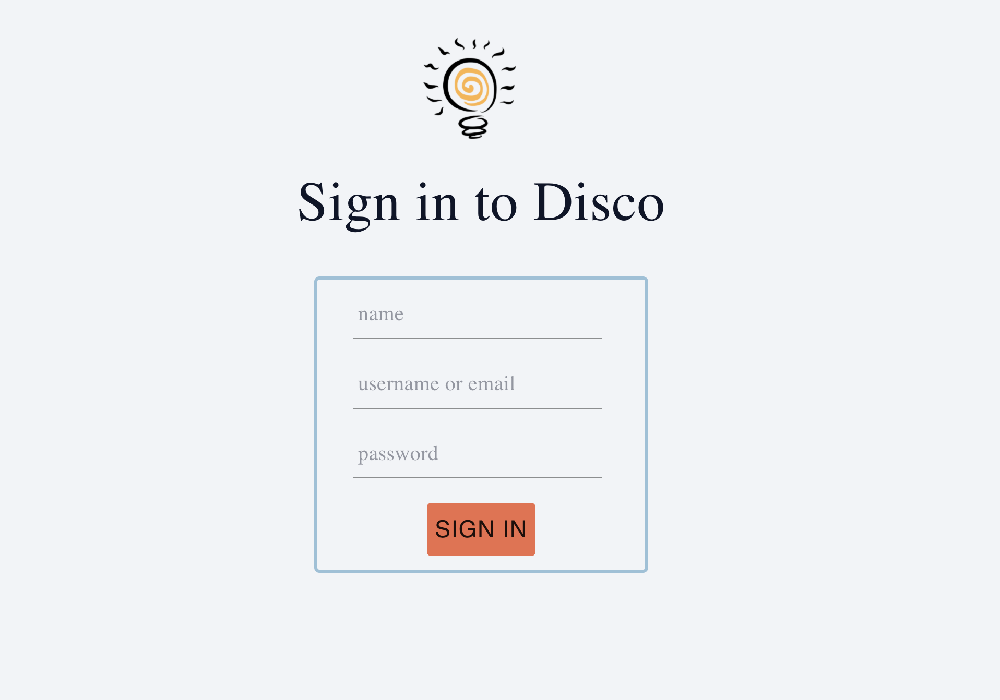
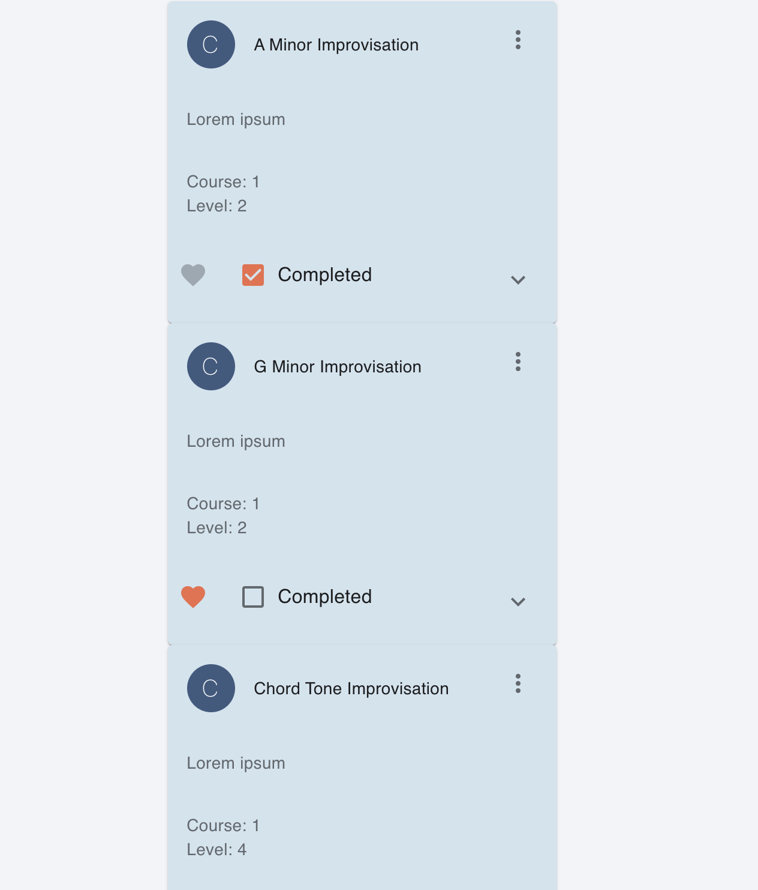

# Software Requirements Specifications

## Problem Statement 

When learning a new skill, it is important for a person to not only practice, but to practice deliberately. Creating a schedule for deliberate practice takes a lot of effort, because it requires breaking the overarching skill into smaller pieces, then organizing those pieces into an order that makes sense to learn. Current schedule creating apps are too broad to use as a tool for deliberate practice as they do not focus on specific skills and do not assist the user in splitting up and ordering the larger skill into subskills.

## Potential Clients
Potential users would be those interested in learning a new skill. While the software should be flexible enough to apply to most skills, it would be good to focus on popular skills that already have a large library of tasks and a large user base. People learning how to play guitar, workout, or cook, for example, could be the first set of clients. 

## Proposed Solution
We propose a card-based app which creates a regimented, deliberate practice schedule for clients. The app would have a catalog of practice cards for a given skill. Each card is categorized by type and includes data such as difficulty, time intensity, and whether the card has been used already. For example, one practice card may be “mincing” which would be categorized as a “knife sub-skill” under the overarching cooking skill. Each day a user can specify how long they would like to practice (e.g. 30 minutes) and based on card-data, the app would construct a schedule with suggested cards, both new and repeated. Users can also create a schedule ahead of time for future sessions.

## Functional Requirements

### Must have
- As a user of the app, I want to be able to revisit a previously practiced deck to practice the skills again.
- As a user of the app, I want to be able to be able to view all course offerings and make a selection about what to practice.
- As a user of the app, I want to be able to create a daily practice schedule for a specific course and select skills to work on so I can learn something new.
- As a user of the app, I want to be able to view “card” metadata, such as topic and skill so I understand what I am working on when I practice a card.
- As a user of the app, I want to be able to select a practice time and have an appropriate number of cards displayed to practice.
- As a user of the app, I want to be able to mark cards as completed and favorite cards.

### Nice to have
- As a user of the app, I want to be able to keep track of my previous, current, and future daily practice schedules so that I can map my learning.
- As a user of the app, I want to be able to make notes on “cards” so I can refer back to previous challenges and thoughts.
- As a user of the app, I want to be able to view and download other peoples “decks” so that I can learn from others.
- As a user of the app, I want to be able to be able to create my course to learn something not already offered on the app.
- As a user of the app, I want to be able to "favorite" a course and view it on my user profile.

## Software Architecture
The software would be a web application. It would conform to the Client-Server software architecture.

**Front end:** React, Material UI

**Back end:** Django, Django REST framework

**Database:** PostgreSQL

**Build-tools:** Yarn

## Wireframes

