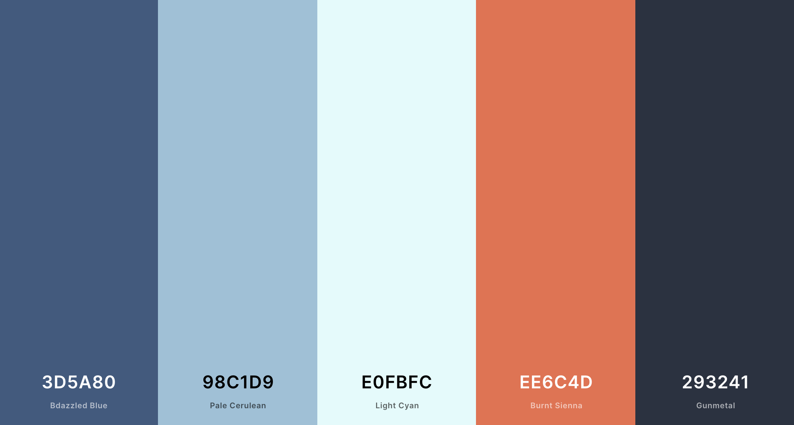

# General Thoughts/Ideas
- Trello Cards (smaller version of card is shown on home screen but can be clicked for more information)
  - use the material-ui card component to initially start styling the cards
- adjust skill selection through a side drawer instead of having to go through a "back" button

## Style Guide

### Colors
See the color palatte here: https://coolors.co/3d5a80-98c1d9-e0fbfc-ee6c4d-293241

Hex Codes
- 3D5A80
- 98C1D9
- E0FBFC
- EE6C4D
- 293241
- F2F4F7

Helpful file: https://material.io/resources/color/#!/?view.left=0&view.right=0

### Fonts

## Framework
### Material UI (https://material-ui.com/)
Material UI is a lightweight, CSS only framework. It is component based and so we only need to store in the app what we will actually use.

## Navbar/Side Drawer
Nav Bar: Not going to have one. Instead, all information will be contained in the side drawer that the user can open/close.

Side Drawer: First seen once you get to Deck, and is open by default. In the side drawer you can change your skill selection, view all cards in the deck, see the calendar for the specific course, and at the bottom of the screen, go back to the home page, see account settings, and logout. 
